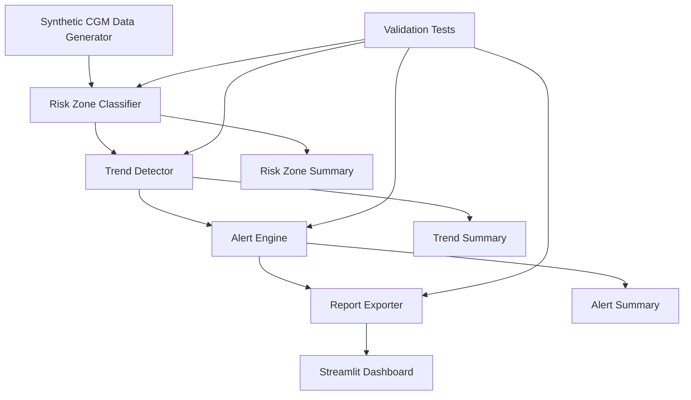
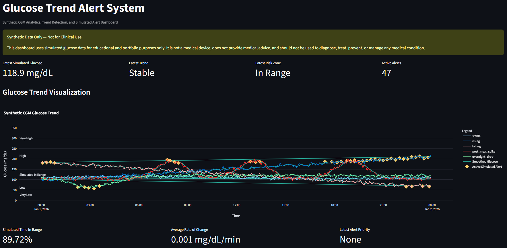
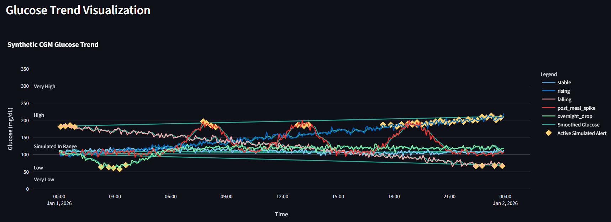
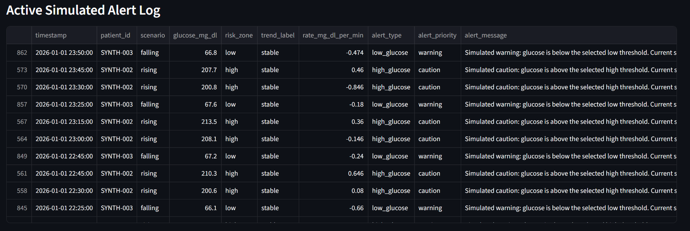

# Glucose Trend Alert System

<p align="center">
  <a href="https://github.com/jfmedina05/glucose-trend-alert-system/actions/workflows/tests.yml">
    
  </a>
  
  
  
  
  
  
  
  
</p>

A synthetic continuous glucose monitor analytics project that detects glucose trends, classifies simulated glucose risk zones, and generates user-centered alerts through a Streamlit dashboard.

This project demonstrates software engineering, healthcare data analysis, medical-device software awareness, validation testing, and healthcare IT pipeline design.

> **Important:** This project uses synthetic data only. It is not a medical device, is not for clinical use, and should not be used to diagnose, treat, prevent, or manage diabetes or any medical condition.

---

## Overview

The Glucose Trend Alert System simulates continuous glucose monitor-style data and processes it through a modular software pipeline.

The system can:

- Generate synthetic CGM-style glucose readings
- Simulate baseline glucose scenarios
- Classify glucose readings into simulated risk zones
- Detect rising, falling, stable, rapidly rising, and rapidly falling trends
- Calculate glucose rate of change in mg/dL per minute
- Generate prioritized simulated alerts
- Apply alert persistence and cooldown logic
- Display glucose trends and alerts in a Streamlit dashboard
- Export processed data and summary reports
- Validate core logic through automated tests

---

## Motivation

Continuous glucose monitoring technology plays an important role in diabetes care by helping users and healthcare systems understand glucose behavior over time.

This project was created to explore how software engineering, data analytics, and user-centered design can support healthcare technology systems. The project is especially focused on concepts relevant to medical device software, diabetes care technology, engineering systems, and healthcare IT.

The goal is not to create a clinical tool. The goal is to demonstrate responsible technical thinking around simulated glucose data, trend detection, alert design, validation, and risk-aware software development.

---

## Important Disclaimer

This project uses **synthetic data only**.

This project is:

- Not a medical device
- Not intended for clinical use
- Not medical advice
- Not a diabetes management tool
- Not connected to a real CGM
- Not using real patient data
- Not affiliated with Abbott, FreeStyle Libre, Dexcom, or any medical device company

No output from this system should be interpreted as medical guidance.

---

## Features

### Synthetic CGM Data Generator

Generates synthetic glucose readings at 5-minute intervals.

Supported baseline scenarios:

- Stable glucose
- Rising glucose
- Falling glucose
- Post-meal spike
- Overnight drop

### Risk Zone Classification

Classifies each synthetic glucose reading into an illustrative risk zone.

| Zone | Simulated Range |
|---|---:|
| Very Low | Below 54 mg/dL |
| Low | 54–69 mg/dL |
| In Range | 70–180 mg/dL |
| High | 181–250 mg/dL |
| Very High | Above 250 mg/dL |

These thresholds are used for simulation only and are not personalized medical guidance.

### Trend Detection

Calculates rate of change between readings:

```text
rate_of_change = (current_glucose - previous_glucose) / minutes_elapsed
```

Trend labels:

| Rate of Change | Trend |
|---:|---|
| >= +2.0 mg/dL/min | Rapidly Rising |
| +1.0 to +1.99 mg/dL/min | Rising |
| -0.99 to +0.99 mg/dL/min | Stable |
| -1.0 to -1.99 mg/dL/min | Falling |
| <= -2.0 mg/dL/min | Rapidly Falling |

### Alert Engine

Generates simulated alerts based on risk zone and trend behavior.

Alert logic includes:

- Alert type classification
- Alert priority assignment
- User-centered alert messages
- Persistence logic
- Cooldown logic
- Suppression reason tracking

Example simulated alert:

```text
Simulated urgent alert: glucose is low and trending downward. Current simulated glucose: 64.0 mg/dL. This is synthetic data only and is not medical advice.
```

### Dashboard

The Streamlit dashboard includes:

- Synthetic glucose time-series visualization
- Risk zone bands
- Smoothed glucose trend line
- Latest glucose metric
- Latest trend metric
- Latest risk zone metric
- Active simulated alert count
- Active alert log
- Processed data table
- CSV download option

---

## System Architecture



---

## Data Pipeline

```text
Input:
Synthetic CGM readings

Processing:
1. Generate or load synthetic glucose data
2. Classify simulated risk zones
3. Calculate time differences
4. Calculate rate of change
5. Detect glucose trends
6. Generate simulated alerts
7. Apply persistence and cooldown logic
8. Export processed data and reports

Output:
- Processed CGM CSV
- Risk zone summary CSV
- Trend summary CSV
- Alert summary CSV
- Streamlit dashboard
```

---

## Tech Stack

| Category | Tools |
|---|---|
| Language | Python |
| Data Processing | pandas, NumPy |
| Visualization | Plotly, Streamlit |
| Testing | pytest |
| Packaging | setuptools, pyproject.toml |
| Documentation | Markdown, Mermaid |
| Version Control | Git, GitHub |

---

## Repository Structure

```text
glucose-trend-alert-system/
│
├── README.md
├── requirements.txt
├── pyproject.toml
├── .gitignore
│
├── src/
│   └── glucose_alert_system/
│       ├── __init__.py
│       ├── data_generator.py
│       ├── risk_classifier.py
│       ├── trend_detector.py
│       ├── alert_engine.py
│       ├── report_exporter.py
│       └── pipeline.py
│
├── tests/
│   ├── test_data_generator.py
│   ├── test_risk_classifier.py
│   ├── test_trend_detector.py
│   ├── test_alert_engine.py
│   └── test_pipeline.py
│
├── docs/
│   ├── requirements.md
│   ├── software_design_document.md
│   ├── risk_management.md
│   ├── validation_plan.md
│   ├── traceability_matrix.md
│   └── regulatory_disclaimer.md
│
├── examples/
│   ├── classify_sample_data.py
│   ├── detect_trends_sample_data.py
│   ├── generate_alerts_sample_data.py
│   └── run_pipeline.py
│
├── dashboard/
│   └── app.py
│
├── data/
│   ├── raw/
│   ├── processed/
│   └── reports/
│
└── assets/
    └── dashboard screenshots and architecture images
```

---

## Example Output

After running the full pipeline, the processed dataset includes columns such as:

| Column | Description |
|---|---|
| timestamp | Synthetic reading timestamp |
| patient_id | Synthetic patient identifier |
| glucose_mg_dl | Simulated glucose value |
| scenario | Synthetic scenario label |
| risk_zone | Simulated glucose risk zone |
| risk_priority | Simulated risk priority |
| glucose_smoothed | Rolling average glucose |
| rate_mg_dl_per_min | Rate of glucose change |
| trend_label | Simulated trend label |
| alert_active | Whether a simulated alert is active |
| alert_type | Final simulated alert type |
| alert_priority | Final simulated alert priority |
| alert_message | User-centered simulated alert message |
| alert_suppressed | Whether a raw alert was suppressed |
| suppression_reason | Reason for alert suppression |

Example processed row:

| timestamp | glucose_mg_dl | risk_zone | trend_label | alert_priority |
|---|---:|---|---|---|
| 2026-01-01 00:15:00 | 64.0 | low | falling | urgent |

---

## How to Run

### 1. Clone the repository

```bash
git clone https://github.com/YOUR-USERNAME/glucose-trend-alert-system.git
cd glucose-trend-alert-system
```

### 2. Install dependencies

```bash
python -m pip install -r requirements.txt
python -m pip install -e .
```

### 3. Generate synthetic data

```bash
python src/glucose_alert_system/data_generator.py
```

### 4. Run the full pipeline

```bash
python examples/run_pipeline.py
```

### 5. Run the dashboard

```bash
python -m streamlit run dashboard/app.py
```

### 6. Run tests

```bash
python -m pytest
```

---

## Validation and Testing

This project includes automated tests for:

- Synthetic data generation
- Risk zone classification
- Trend detection
- Rate-of-change calculation
- Alert generation
- Alert persistence logic
- Alert cooldown logic
- End-to-end pipeline behavior

Run all tests:

```bash
python -m pytest
```

Example validation areas:

| Area | Validation Method |
|---|---|
| Risk classification | Boundary-value unit tests |
| Trend detection | Stable, rising, falling, rapidly rising, rapidly falling tests |
| Alert logic | Scenario-based alert tests |
| Pipeline behavior | End-to-end processing tests |
| Dashboard | Manual UI review |

---

## Medical Device and Regulatory Awareness

This project is not a medical device, but it is intentionally documented using medical-device-inspired software engineering practices.

Included documentation:

- Software requirements specification
- Software design document
- Risk management summary
- Validation plan
- Requirements traceability matrix
- Regulatory and clinical use disclaimer

Concepts demonstrated:

- Intended-use limitations
- Synthetic data handling
- Requirements-driven development
- Verification and validation testing
- Risk-aware alert design
- Human factors and usability awareness
- Alert fatigue reduction through persistence and cooldown logic
- Clear non-clinical-use disclaimers

---

## Dashboard Preview





---

## Future Improvements

Potential extensions:

- Add SQLite database logging
- Add FastAPI backend
- Add Docker support
- Add GitHub Actions CI testing
- Add Power BI-style reporting export
- Add predictive glucose risk model using scikit-learn
- Add configurable scenario builder
- Add simulated sensor dropout and noisy data validation
- Add embedded-system-style simulation layer
- Add expanded alert fatigue reduction logic
- Add formal software hazard analysis table

---

## Portfolio Relevance

This project demonstrates skills relevant to:

- Healthcare technology
- Medical device software
- Diabetes care systems
- Software engineering
- Data analytics
- Healthcare IT
- Dashboard development
- Validation testing
- Risk-aware engineering
- User-centered alert design

---

## License

This project is for educational and portfolio purposes.

---

## Disclaimer

This project uses synthetic data only.

This project is not a medical device, is not for clinical use, and should not be used to diagnose, treat, prevent, or manage diabetes or any medical condition.

This project is not affiliated with Abbott, FreeStyle Libre, Dexcom, or any medical device company.
